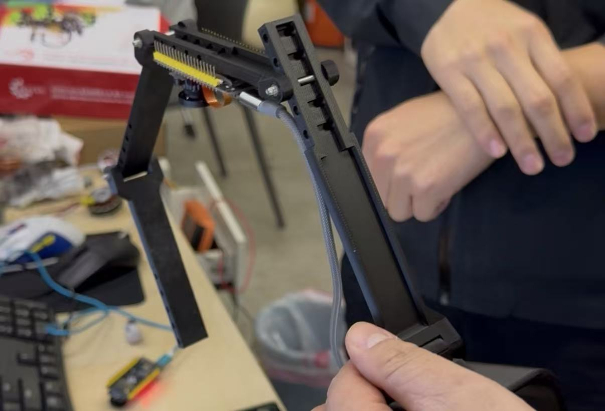

# Hand-Vision-Perception-System
手部视觉感知系统   Hand Vision Perception System

手部视觉感知系统（核心是通过视觉传感器+算法，精准捕捉手部**姿态、动作、位置、纹理**甚至微小形变，实现“手-机/设备/环境”的无接触、高精度交互），其应用场景覆盖工业、消费电子、医疗、安防等多领域，核心围绕“精准交互、高效检测、安全作业”三大核心需求展开，具体可分为以下几类，每类均包含核心场景+落地逻辑：

  
  
   
### 一、工业制造领域（核心需求：高精度、高稳定性、替代人工）
这是手部视觉感知系统最成熟的应用场景，核心解决“人工操作精度不足、高危环境作业、批量检测效率低”的问题，适配自动化生产线全流程。
1.  精密装配与抓取：适配3C电子（手机屏幕贴合、芯片插件）、汽车零部件（微小螺丝拧紧、线束对接）、航空航天（精密零件装配），通过感知手部（或机械臂模拟手）的姿态、指尖力度反馈（视觉+力觉融合），实现毫米级精准抓取、装配，避免人工操作的偏差的损耗；
2.  手部作业合规检测：针对化工、电力、矿山等高危行业，实时感知操作人员手部是否佩戴合规防护装备（手套、绝缘手套）、是否做出违规动作（如触碰高压部件、违规拆卸设备），一旦违规立即触发报警，规避安全事故；
3.  产品缺陷视觉检测：通过感知手部握持的工件（如五金件、塑料件），快速识别工件表面划痕、裂纹、毛刺等缺陷，同时捕捉手部操作轨迹，判断操作流程是否合规，兼顾“产品质检+作业规范管控”。

### 二、消费电子与智能家居（核心需求：便捷交互、沉浸式体验）
聚焦“无接触、自然交互”，替代传统按键、触控，适配日常高频使用场景，降低交互门槛，提升体验感。
1.  智能终端无接触交互：手机、平板、电脑、智能电视的手势控制，比如挥手解锁、隔空滑动屏幕、手势调节音量/亮度，无需触碰屏幕即可操作（适配湿手、脏手场景，如厨房做饭时操作智能屏）；
2.  智能家居场景联动：通过手部姿态指令控制全屋设备，比如抬手开灯、握拳关窗帘、手势调节空调温度，实现“手控万物”的沉浸式智能体验，适配老人、小孩等不熟悉APP操作的人群；
3.  VR/AR沉浸式交互：在VR游戏、AR办公场景中，感知用户手部实时姿态、动作，实现虚拟场景中的“伸手抓取、挥手操作、手势建模”，打破传统手柄的操作限制，让虚拟交互更自然（如VR游戏中挥手打怪、AR设计中抬手拖拽模型）。

### 三、医疗健康领域（核心需求：高精度、无菌化、辅助诊疗）
适配医疗场景的“无菌要求、精准操作、康复监测”，分为诊疗辅助、康复训练两大核心场景，兼顾医生操作便捷性与患者康复效率。
1.  手术辅助与无菌操作：微创手术中，通过视觉感知医生手部姿态、动作轨迹，辅助引导手术器械精准定位（如腹腔镜手术中，同步手部动作控制器械移动），同时检测医生手部是否脱离无菌区域、是否佩戴无菌手套，规避术中感染；
2.  手部康复评估与训练：针对中风、脑瘫、手部外伤术后患者，实时感知患者手部的关节活动度、抓握力度、动作协调性，生成个性化康复评估报告，同时通过引导患者做出指定手部动作（如握拳、伸指），辅助完成康复训练，实时反馈训练效果；
3.  远程医疗交互：远程问诊中，通过手部视觉感知，让医生清晰看到患者手部的症状（如皮疹、肿胀、畸形），同时感知患者手部动作（如抬手、握拳），判断肢体活动能力，替代线下面诊的手部检查，提升远程诊疗的精准度。

### 四、安防与公共服务（核心需求：身份识别、安全管控、便捷服务）
聚焦“快速识别、安全防控、便民服务”，适配公共场景的高频需求，兼顾安全性与便捷性。
1.  手部生物特征识别：替代指纹识别（适配指纹磨损、脏污场景），通过感知手部纹理、掌纹、指节形状，实现身份精准核验，适配门禁、地铁安检、银行取款等场景，快速完成身份认证，提升通行/办理效率；
2.  公共场景安全管控：在机场、火车站、商场等人员密集场所，感知手部是否携带违禁物品（如刀具、易燃易爆物品）、是否做出危险动作（如挥拳、抛掷物品），实时预警，辅助安保人员快速处置；
3.  便民服务交互：政务大厅、银行自助机、医院自助终端，通过手部手势操作（如挥手切换界面、握拳确认办理），无需触碰终端屏幕（规避交叉感染），适配老人、小孩及疫情防控场景，提升便民服务体验。

### 五、特殊场景与新兴领域（核心需求：适配极端环境、创新交互）
覆盖小众但高价值场景，依托手部视觉感知的“灵活性、抗干扰性”，解决特殊场景的交互/检测难题。
1.  水下作业辅助：潜水员水下作业时，通过防水视觉传感器感知手部姿态，实现与水面控制台的手势交互（如抬手表示正常、握拳表示请求支援），同时检测手部是否佩戴防水装备、作业动作是否合规，规避水下作业风险；
2.  手语实时翻译：通过感知听障人士的手部手语动作，实时转化为文字/语音，适配日常沟通、政务办理、校园交流等场景，打破听障人士与健全人的沟通壁垒；
3.  机器人协作交互：工业协作机器人、服务机器人与人类协同作业时，通过感知人类手部姿态、动作，判断人类的操作意图（如抬手示意机器人停止、挥手示意机器人移动），实现“人-机”安全、高效协作，避免机器人误操作。
   
所有场景均围绕“视觉捕捉→算法解析→指令执行/反馈”的核心逻辑，落地的关键的是“抗干扰性”（如强光、油污、遮挡场景下的精准感知）和“精度适配”（工业需毫米级、消费电子需厘米级、医疗需亚毫米级）；未来还会延伸至元宇宙、仿生机器人、智能穿戴等领域，进一步拓宽“手部感知+交互”的边界。

The hand visual perception system (the core of which is to precisely capture hand **posture, movement, position, texture** and even minute deformations through visual sensors and algorithms, achieving non-contact, high-precision interaction between "hand-device/environment") has application scenarios covering multiple fields such as industry, consumer electronics, healthcare, and security. It focuses on three core demands: "precise interaction, efficient detection, and safe operation". Specifically, it can be classified into the following categories, each including core scenarios and implementation logic: 

### I. Industrial Manufacturing Field (Core Requirements: High Precision, High Stability, Replacing Manual Labor)
This is the most mature application scenario for hand visual perception systems, addressing the core issues of "insufficient manual operation precision, high-risk environment operations, and low efficiency in batch inspection", and is suitable for the entire process of automated production lines.
1. Precision Assembly and Grasping: Applicable to 3C electronics (such as phone screen bonding, chip insertion), automotive parts (such as tightening tiny screws, connecting wire harnesses), aerospace (such as precise parts assembly), by perceiving the hand's (or mechanical arm simulating a hand) posture and fingertip force feedback (visual + force sensing integration), achieving millimeter-level precise grasping and assembly, avoiding deviations and losses caused by manual operations.
2. Hand Operation Compliance Inspection: For high-risk industries such as chemical, power, and mining, it can real-time perceive whether the operator's hands are wearing compliant protective equipment (such as gloves, insulating gloves) and whether they are making any non-compliant actions (such as touching high-voltage components, unauthorized disassembly of equipment). Once a violation is detected, an alarm is immediately triggered to prevent safety accidents.
3. Visual Inspection of Product Defects: By perceiving the workpiece held by the hand (such as metal parts, plastic parts), it can quickly identify surface defects such as scratches, cracks, and burrs on the workpiece, while capturing the hand's operation trajectory to determine if the operation process is compliant, thus integrating "product quality inspection and operation standard control". 

### II. Consumer Electronics and Smart Home (Core Demands: Convenient Interaction, Immersive Experience)
Focusing on "contactless and natural interaction", it replaces traditional buttons and touch screens, adapts to daily high-frequency usage scenarios, lowers interaction barriers, and enhances the experience.
1. Contactless interaction for smart terminals: Gesture control for mobile phones, tablets, computers, and smart TVs, such as waving to unlock, swiping the screen in the air, and adjusting volume/brightness with gestures, allowing operation without touching the screen (suitable for wet or dirty hands, such as operating a smart screen while cooking in the kitchen).
2. Smart home scene linkage: Control all home devices through hand gestures, such as raising a hand to turn on the lights, clenching a fist to close the curtains, and adjusting the air conditioner temperature with gestures, achieving an immersive intelligent experience of "controlling everything with hands", suitable for the elderly, children, and others who are not familiar with app operations.
3. Immersive interaction in VR/AR: In VR games and AR office scenarios, it perceives the user's real-time hand posture and movements, enabling "reaching out to grab, waving to operate, and gesture modeling" in virtual scenes, breaking the operational limitations of traditional controllers and making virtual interaction more natural (such as waving to attack monsters in VR games or raising a hand to drag models in AR design). 

### III. Medical and Health Field (Core Requirements: High Precision, Sterility, and Assisted Diagnosis and Treatment)
Adapted to the "sterility requirements, precise operation, and rehabilitation monitoring" of medical scenarios, it is divided into two core scenarios: diagnosis and treatment assistance and rehabilitation training, taking into account the convenience of doctors' operations and the efficiency of patients' rehabilitation.
1. Surgical Assistance and Sterile Operation: In minimally invasive surgeries, it perceives the doctor's hand posture and movement trajectory through visual perception, assisting in guiding surgical instruments to precise positioning (for example, in laparoscopic surgery, synchronizing hand movements to control the movement of instruments), while detecting whether the doctor's hands have left the sterile area or if they are wearing sterile gloves, to avoid intraoperative infections.
2. Hand Rehabilitation Assessment and Training: For patients with stroke, cerebral palsy, or post-hand injury, it real-time perceives the joint range of motion, grip strength, and movement coordination of the patient's hand, generating personalized rehabilitation assessment reports. At the same time, it guides patients to perform designated hand movements (such as making a fist, extending fingers) to assist in completing rehabilitation training and provides real-time feedback on training effects.
3. Remote Medical Interaction: In remote consultations, through hand visual perception, it enables doctors to clearly see the patient's hand symptoms (such as rashes, swelling, deformities), and simultaneously perceive the patient's hand movements (such as raising the hand, making a fist), to assess limb mobility, replacing the hand examination in face-to-face consultations and enhancing the accuracy of remote diagnosis and treatment. 

### IV. Security and Public Services (Core Demands: Identity Verification, Security Control, Convenient Services)
Focusing on "rapid identification, security prevention and control, and convenient services", it caters to the high-frequency demands of public scenarios, balancing security and convenience.
1. Hand Biometric Recognition: Replacing fingerprint recognition (suitable for scenarios where fingerprints are worn or dirty), it achieves precise identity verification by perceiving hand textures, palm prints, and knuckle shapes. It is applicable to scenarios such as access control, subway security checks, and bank withdrawals, enabling quick identity authentication and enhancing passage/processing efficiency.
2. Security Control in Public Scenarios: In crowded places like airports, railway stations, and shopping malls, it detects whether hands carry prohibited items (such as knives, flammable and explosive substances) or perform dangerous actions (such as punching, throwing objects), providing real-time alerts to assist security personnel in rapid response.
3. Interactive Convenient Services: In government service halls, bank self-service machines, and hospital self-service terminals, hand gestures (such as waving to switch interfaces, clenching fists to confirm transactions) are used for operation without touching the terminal screens (avoiding cross-infection), suitable for elderly people, children, and epidemic prevention scenarios, enhancing the experience of convenient services. 

### V. Special Scenarios and Emerging Fields (Core Requirements: Adaptation to Extreme Environments, Innovative Interaction)
Covering niche but high-value scenarios, relying on the "flexibility and anti-interference" of hand visual perception to solve interaction/detection challenges in special scenarios.
1. Underwater operation assistance: When divers are working underwater, waterproof visual sensors perceive hand gestures to enable gesture interaction with the surface control console (such as raising a hand to indicate normal operation and making a fist to request support), while also detecting whether the hands are wearing waterproof equipment and whether the operation actions are compliant, to avoid underwater operation risks.
2. Real-time sign language translation: By perceiving the hand gestures of deaf people, it is translated into text/speech in real time, suitable for daily communication, government affairs handling, campus exchanges, etc., breaking down the communication barriers between deaf people and the hearing.
3. Human-robot collaborative interaction: When industrial collaborative robots and service robots work with humans, by perceiving human hand gestures and movements, it can determine human operation intentions (such as raising a hand to indicate the robot to stop and waving a hand to indicate the robot to move), achieving safe and efficient "human-robot" collaboration and avoiding robot misoperation. 

All scenarios revolve around the core logic of "visual capture → algorithmic analysis → instruction execution/feedback". The key to implementation lies in "anti-interference" (such as precise perception in strong light, oil stains, and occlusion scenarios) and "precision adaptation" (industrial applications require millimeter-level accuracy, consumer electronics need centimeter-level accuracy, and medical applications demand sub-millimeter-level accuracy). In the future, it will also extend to fields such as the metaverse, bionic robots, and smart wearables, further expanding the boundaries of "hand perception + interaction".

  
  

## 致谢
感谢项目组成员田宇鑫在项目迭代与数据处理中做出的贡献，感谢张东老师在项目方案上的精准指导，也感谢项目组其他成员的通力协作。

## 加入社区

  
  
